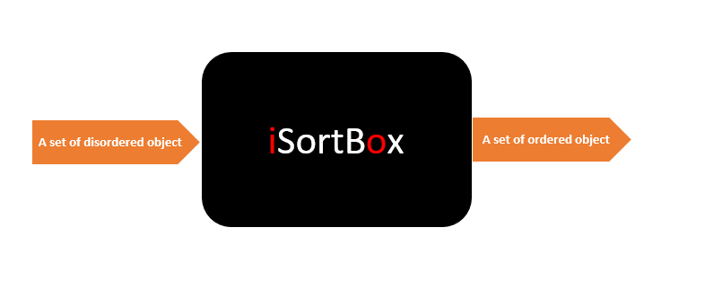
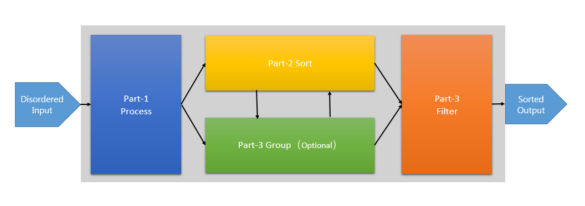
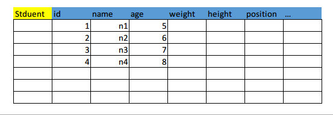
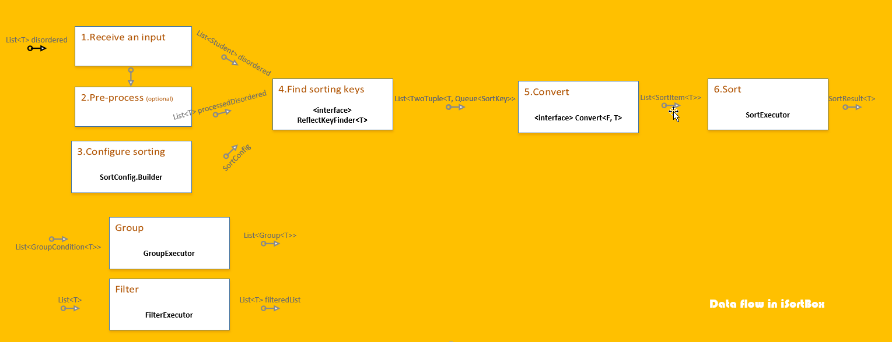

# iSortBox


## Summary
What is iSortBox? Just like what it says: **Simplify sorting!**

 This framework achieves a goal which makes sorting easier, moreover, you will benefit from what it provides such as pre-processing, converting, grouping and filtering.
 
 As the name **iSortBox**, the letter 'i' means input and the letter 'o' means output, as for the details on how to complete the work, all are encapsulated in iSortBox.
 
 ## Design Prototype
 In this chapter, some pictures about iSortBox will be posted here. 
 
 ### Why iSortBox?
 
 
 What iSortBox tries to solve is **to standardize the usage of sorting in a project**. That's the aim of iSortBox. There are no advanced skills and technologies in iSortBox, instead, it just simplifies sort by encapsulating several standardized and  processed steps to make you sort easily.
 
 Therefore, iSortBox acts as a helper framework. Once you want to sort a disordered set, iSortBox will help you solve the sorting issue.
 
 
 ### iSortBox Prototype
 
 
 There are **two necessary parts** and **two optional parts** in the design prototype.
 
 The **necessary parts** are 
 - Process (part 1)
 - Sort (part 2)
 
 The **optional parts** are
 - Group (part 3)
 - Filter (part 4)

These parts are obtained through a lot of trying and analyzing. In order to complete a sorting, these parts are enough for developers.

Next, I will analyze each part with code and how to make full use of these parts.


## Analysis

Before the analysis, I introduce a class named `Student`. It is used to code samples.
```Java
public class Student {
    private int id;
    private String name;
    private int age;
    private float weight;
    
    public Student(int id, String name, int age, float weight) {
        this.id = id;
        this.name = name;
        this.age = age;
        this.weight = weight;
    }
    
    public int getId() {
        return this.id;
    }
    
    public String getName() {
        return this.name;
    }
    
    public int getAge() {
        return this.age;
    }
    
    public float getWeight() {
        return this.weight;
    }
}
```

### Part-1/2  Process and Sort
The part of process is going to complete several steps, it contains :
1. Receive an input
2. Pre-process (optional)
3. Configure sorting
4. Find sorting keys
5. Convert
6. Sort
7. Sample

------

1.1  **Receive an input**

As the prototype mentioned, iSortBox needs an input entrance. Presume that there is a list of `Student`.
```Java
List<Student> studentList = new ArrayList<>(4);
studentList.add(new Student(3, "Daniel", 14, 89.3f));
studentList.add(new Student(1, "Larry", 13, 65.5f));
studentList.add(new Student(20, "John", 14, 74.0f));
studentList.add(new Student(15, "Lyn", 10, 70.2f));
```
Now, four students are generated. The list `studentList` is going to be ordered by iSortBox, Now, the list acts as input to enter the iSortBox, that is, the **receiving an input**.

------

1.2 **Pre-process (Optional)**

Then you may want to pre-process your input. Step 2 **Pre-process** will do it. In iSortBox, an interface named `Process`  existing the package underneath `sortbox.common.process`  undertakes the task. You can define a new interface to extend it or a new class to implement it. For example :
```Java
public class InputListProcess implmenents Process<List<?>> {
    @Override
    public void process(List<?> target, Object... args) {
        removeEmpty(target);
    }
}
```
You can create the instance of it to be used as an argument passed into a method in `SortExecutor`. Anyway, this step is optional. 

**_Use pre-process before sorting when you need_**.

------

1.3 **Configure Sorting**

In iSortBox, **sort is regarded as sort a collection by one property or some properties**. 

For example, you may need the `studentList` to be sorted by id from 1 to N. You may need to sort the list by `name` from 'a' to 'z'. **The actual intent of sort is to sort values on some properties**.

Sort is a process to define a `Comparator`. If you think that sort is as simple as defining a `Comparator`, why to write the iSortBox instead of using `Comparator` directly? If you know only one known property and use this property to sort a list, nothing different. In contrast, using `Comparator` directly will save lots of resources.
```Java
Collections.sort(studentList, new Comparator<>() {
    @Override
    public int compare(Student s1, Student s2) {
        return s1.getId() - s2.getId();
    }
});
```

However, there is a more common case, you don't know which property will be used to sort a list at all until clients or users trigger a sort by a certain property they select. Just like Excel.



Users may select the column of `id` to sort the `studentList` or select the column of `name` to sort. 

For the cases above, developers can still use `Comparator` to complete the task. But iSortBox provides a more convenient way to do it.

The mechanism is **reflection** in Java.

First of all, iSortBox uses reflection to generate a `PropertyTable` which holds the properties information of `T`, the `Student`. The `PropertyTable` records the name of a property, the type of a property, and the value of a property. The object is used to be searched by developers and provided to show at some UI interface for being selected by users.
```Java
List<PropertyTableItem> list = new PropertyTable<Student>().check(studentList.get(0)).getPropertyList();
```

Or
```Java
List<PropertyTableItem> list = new PropertyTable<Student>().check(Student.class).getPropertyList();
```

If you only want to get the name and type of properties without concrete values, the latter is better. 

Well, iSortBox gives us a table recording properties information, for developers and users, are able to specify some properties to sort a list. It's time to introduce the `SortConfig<T>` class. `SortConfig<T>` is a manifest file.

```Java
SortConfig<Student> config = new SortConfig<Student>().new Builder()
    .set(1, "id", new NumberOrderComparator<>(true))
    .set(2, "name", new NameComparator<>())
    .combineMode(CombineMode.MULTIPLE)
    .useDefaultComparator(false)
    .build();
```

Please look at the code, `T` is the generic type of `Student` which means that the configuration is provided by an instance of `Student`. It's easy to use **Builder Pattern** to build up a configuration. Now `set(int priority, String propertyName, AbstractComparator<T> comparator)`method is the key of the whole configuration.
- `int priority` : means that the property is given to a priority when sort happens. The level in a range from 0 to N indicates the highest level to lowest level.

- `String propertyName` : means that the name of a property.

- `AbstractComparator<T> comparator`: means that how to sort a list, it can be `null`.

  Well, a call to `set(1, "id", new NumberOrderComparator<>(true))` means that a list will be sorted by `id` using `NumberOrderComparator` firstly.

`combineMode(CombineMode.MULTIPLE)` is easy to understand. `CombineMode` is an enumeration class which has two instances of `SINGLE` and `MULTIPLE`.
- `SINGLE`: means that users and developers can only specify one property which has the highest priority to sort a list , the others will be dropped off. However if you specify more than one properties, only one property will be kept, the one which has the highest priority. If you specify one property only but the property doesn't exist, a failed sorting but iSortBox will return you the original data list that encapsulated in `SortResult`.

- `MULTIPLE`: means that you can specify more than one properties, no amount limitation. Those you specify will be saved in a map, its key is `TwoTuple<Integer, String>`, its value is `AbstractComparator<T>`.  The map is a middle variable, later, those will be handled. Here, you just need to know that `MULTIPLE` allows you to specify more properties.

`useDefaultComparator(boolean use)` is an error compatible method. When you call `set(..)` and pass in a null Comparator, you can setup this method to notify iSortBox whether to enable the default comparator `DefaultComparator`. If you set `false` meanwhile comparator is null, iSortBox will return you the original data list that encapsulated in `SortResult`.

When `build()` is called, an instance of `SortConfig<T>` will be generated.

------

1.4 **Find sorting keys (private implementation)**

Once you specify the properties whatever you give or you select from `PropertyTable`, **Find sorting keys** is an important step. iSortBox is going to pick out these properties you select then it checks whether these properties are truly existing through `PropertyTable` or direct reflection. After checking, the remaining properties will be put into `SortKey` which has the same role as `PropertyTableItem`.

The result of finding sort key  is `List<TwoTuple<T, Queue<SortKey>>>`. `TwoTuple<F, S>` is a kind of skill that makes two objects become one object. As above, `T` can be regarded as the type of `Student`, `Queue<SortKey>` is a set of `SortKey` which holds the information of specified properties. 

------

1.5. **Convert (private implementation)**

Before illustrating what is convert, let's familiar with a class `SortItem<T>`. This class collects a set of `SortKey`and keeps an original data of `T`. Actually, when `SortExecutor` executes a sort, it sorts a list of `SortItem<T>`.  You are maybe puzzled about this, but class `SortItem<T>` is a middle component as well, it belongs to the inner detail of iSortBox framework. The reason of why this class is designated in iSortBox is to complete sorting but keeps the original data.

------

1.6 **Sort**

Step Sort is the simplest one in these steps.

What is sorting for Java? If you find out the answer, the principle of iSortBox is so easy to understand. 

**In Java, sort is the Comparator** !

No matter how complicated the sorting rules are, just to define your own Comparators. As I mentioned above, iSortBox is not the expert at algorithm and effectiveness of sort, to be honest, those more efficient algorithms are beyond my abilities.

So, defining your comparators under different cases or demands is the key step. `Sorter<T>` class takes charge in sorting a list. Actually, a `SortConfig<T>` is attached with some `AbstractComparator`s, as for the further call, iSortBox just call `Collections.sort(..)` to sort a list.

------

1.7  **Sample**

```Java
SortConfig<Student> sortConfig = new SortConfig<Student>().new Builder()
      .set(4, "id", new NumberOrderComparator<>(true))
      .set(1, "name", new NameComparator<>())
      .combine(CombineMode.SINGLE)
      .useDefaultComparator(false)
      .build();

SortedResult<Student> result = new SortExecutor<Student>()
      .input(studentList)
      .preProcess(null)
      .sortConfig(sortConfig)
      .sort();      // must && call in order
```

### Part-3 Group (Optional)
Grouping is a useful and optional part. What's the aim? If you have a demand like this: Please group students into different groups by their age. There are three defined groups by age, 0 - 10 / 10 - 20 / 20 - n. And you should group the student list by this rule before sorting or after sorting. Grouping will cause two kinds of result: 
1. Before sorting : If grouping is previous to sorting, iSortBox will generate a list of `Group<T>`, each `Group<T>` holds a list of `T` that satisfies the group condition. You'd better not to worry about this, even grouping is previous to sorting, you can sort the list of `T` from `Gruop<T>`, the result is same.

2. After sorting : Normal case.

What is the concept of Grouping? Grouping is an action that gathers a collection of the object satisfying a condition. For example, 10 < age < 20 is a condition, if a student's age is 15, it will be grouped into a group collecting the age from 10 to 20. 

However, how to express the abstract concept in a Programming Language? Grouping is an abstract concept absolutely because you can't give an exact description at all. The reason why we can't describe it is that we regard it as OOP (Object-Oriented-Programming), not Functional Programming. 

That's right! Group part is applied to functional programming. If we try to understand that a group is equaled to a condition, the condition is a function. Therefore, iSortBox uses `java.util.function.Predicate` to achieve the goal. In design pattern, it is the **Strategy Pattern**. The strategy is an interface. For `Predicate<T>`, it is a functional interface that provides a function `boolean test(T var1)`, if a `var1` passes the `test(..)`, that is, returns `true`,  predicate successfully. You can compose your own strategies as demand required.

As for iSortBox, `GroupCondition` implements it.
```Java
public abstract class GroupCondition<T> implements Predicate<T> {
    private List<T> input;
    private Group<T> mGroup;
    
    public GroupCondition(List<T> input, Object key) {
        ...
    }
  
    public abtract Group<T> execute();
}
```

For example. If we want to collect some students whose age is in range of 15 - 20 years old, we can do like this :

```Java
public class AgeGroupCondition<Student> extends GroupCondtion<Student> {
    private List<Student> studentList;
    private int from;
    private int to;
    
    public AgeGroupCondition(List<Student> input, String key, int from, int to) {
        super(input, key);
        this.studentList = input;
        this.from = from;
        this.to = to;
    }
    
    @Override
    public Group<Student> execute() {
        studentList.stream().filter(this).forEach(this::shot); 
        return getGroup();
    }
    
    @Override
    public boolean test(Student student) {
        int age = student.getAge();
        return age >= from && age < to;
    }
}
```

How to use this `AgeGroupCondtion`, `GroupExecutor` will help.

1. Create an instance of `GroupExecutor` and execute the condition.
2. Get the data you need.

```Java
GroupExecutor executor = GroupExecutor.newInstance();
Group<Student> group = executor.executeSingle(new AgeGroupCondtion(input, "age", 15, 20));
List<Student> groupedStudents = group.getDataList();
System.out.println(Arrays.toString(groupedStudents.toArray()));
```

### Part-4 Filter (Optional)
Why iSortBox supports filter? The mechanism of **Filter** is same as **Group**. Both are applied to functional programming with `java.util.function.Predicate`. However, their intents are different. Filter tends to remove something.

The Filter is an optional part, that is, you can filter anywhere as you need.

Filter in iSortBox
```Java
public interface Filter<T> extends Predicate<T> {
    void filter(T t);
}
```

You can define your own filters as demand required. For example, if we want to remove the first element in a list, do like this:
```Java
public class RemoveFirstFilter<T> extends ListFilter<T> {
    
    @Override
    public void filter(List<T> input) {
        super.filter(input);
        input.remove(0);
    }
    
    @Override
    public void test(List<T> input) {
        // useless here.
        return false;
    }
}
```
Note that, `ListFilter` is a pre-defined filter in class which is used to filter a list.

How to execute the filter?
```Java
FilterExecutor executor = FilterExecutor.newInstance();
executor.execute(group.getDataList(), new RemoveFirstFilter<>());
```

## Data Flow


## Declaration

### 1. About iSortBox
First of all, iSortBox is still in beta version. I finished it in plan and wrote codes by design. All the projects I start right now are aimed at practicing and learning. There are so many things to learn and conclude, write code and it'd better be applied to some actual issues. 

Thus, I think iSortBox is not the best solution to solve sorting issue but the best way for me to digest what I've learned.

**If you want to take it to you official projects or  important projects, please CONSIDER CAREFULLY.**

### 2. Shortcomings

As a newborn project, iSortBox has some shortcomings and something worth improving.
1. `SortKey` and `PropertyTableItem` are both kept in the project. Actually, they should be merged into one to express the same meaning.

2. I still think the cases that iSortBox can be applied to are limited and meaningless. However, this shortcoming should be dug further.

3. If iSortBox is measured by a good framework, it is a bit of complicated. The kind of complexity is not the usage, is implementation. In terms of learning, it is accepted.

1. If the number of the disordered objects is huge, in other words, the efficiency is not tested under the case.

1. Specifying a property by name is unreliable.  
2. Java 8 or later versions is required.

### 3. Improvement

Annotation is a better solution, I deem.
